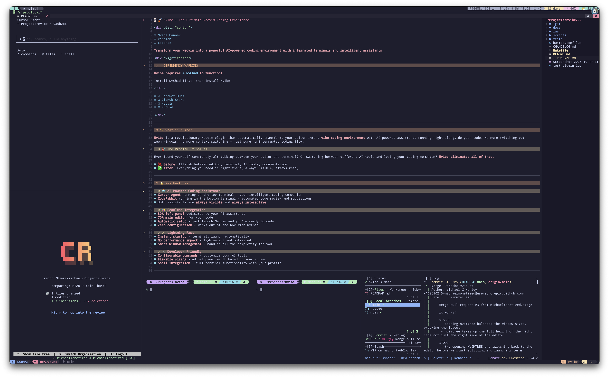

# 🚀 Nvibe - The Ultimate Neovim Coding Experience

<div align="center">


**Transform your Neovim into a powerful AI-powered coding environment with integrated terminals and intelligent assistants.**

<div align="center">

## ⚠️ DEPENDENCY WARNING ⚠️

**Nvibe requires [NvChad](https://github.com/NvChad/NvChad) to function!**

Install NvChad first, then install Nvibe.

</div>

[](https://www.producthunt.com)
[](https://github.com/michaelmonetized/nvibe)
[](https://neovim.io)
[](https://github.com/NvChad/NvChad)

</div>

---

## ✨ What is Nvibe?

**Nvibe** is a revolutionary Neovim plugin that automatically transforms your editor into a **vibe coding environment** with AI-powered assistants running right alongside your code. No more switching between windows, no more context switching – just pure, uninterrupted coding flow.

### 🎯 The Problem It Solves

Ever found yourself constantly alt-tabbing between your editor and terminal? Or switching between different AI tools and losing your coding momentum? **Nvibe eliminates all of that.**

- ❌ **Before**: Alt-tab between editor, terminal, AI tools, documentation
- ✅ **After**: Everything you need is right there, always visible, always ready

---

## 🌟 Key Features

### 🤖 **AI-Powered Coding Assistants**
- **Cursor Agent** running in the top-left terminal - your intelligent coding companion
- **CodeRabbit** running in the bottom-left terminal - automated code review and suggestions
- **LazyGit** running in the bottom-right terminal - git operations made easy
- **Shell Terminal** running in the bottom-center - your command line interface
- All assistants are **always visible** and **always interactive**

### 🎨 **Seamless Integration**
- **Left panel** with AI assistants (Cursor Agent + CodeRabbit) - full height
- **Bottom panel** with development tools (Shell + Shell + LazyGit) - full width
- **Main editor** takes up the top-right area - perfectly balanced workspace
- **Automatic setup** - just launch Neovim and you're ready to code
- **Zero configuration** - works out of the box with NvChad

### ⚡ **Lightning Fast**
- **Instant startup** - terminals launch automatically
- **No performance impact** - lightweight and optimized
- **Smart window management** - handles all the complexity for you

### 🔧 **Developer Friendly**
- **Configurable commands** - customize your AI tools
- **Flexible sizing** - adjust panel width based on your screen
- **Shell integration** - full terminal functionality with your profile

### 🧠 **Smart Layout Management**
- **Automatic Layout Restoration** - `<leader>e` automatically restores layout after nvimtree operations
- **Minimap Integration** - Automatically toggles minimap before nvimtree when buffer has content
- **Window Balancing Protection** - Prevents nvimtree from breaking your carefully crafted layout
- **Manual Control** - `M.restore_layout()` function for manual layout restoration
- **Error Resilience** - Graceful handling of missing dependencies and failed terminals

---

## 🚀 Quick Start

> **⚠️ IMPORTANT**: Nvibe requires **NvChad** to function! Install NvChad first: https://github.com/NvChad/NvChad

### Step 1: Install NvChad (Required)
```bash
# Backup your current config
mv ~/.config/nvim ~/.config/nvim.backup

# Install NvChad
git clone https://github.com/NvChad/NvChad ~/.config/nvim
```

### Step 2: Install Nvibe

### Option 1: Using Lazy.nvim (Recommended)
```lua
{
  'michaelmonetized/nvibe',
  config = function()
    require('nvibe').setup()
  end
}
```

### Option 2: Using Packer
```lua
use {
  'michaelmonetized/nvibe',
  config = function()
    require('nvibe').setup()
  end
}
```

### Option 3: Manual Installation
```bash
git clone https://github.com/michaelmonetized/nvibe.git ~/.config/nvim/lua/nvibe
```

### Usage

That's it! Just launch Neovim and Nvibe automatically:
1. 🎯 Creates a left panel with AI assistants (full height)
2. 🤖 Launches Cursor Agent in the top-left terminal
3. 🐰 Launches CodeRabbit in the bottom-left terminal
4. 📊 Creates a bottom panel with development tools (full width)
5. 💻 Launches two Shell Terminals side-by-side
6. 🔧 Launches LazyGit in the rightmost terminal
7. ✨ You're ready to code with AI assistance and all your tools!

### Advanced Usage

#### Manual Layout Restoration
If your layout gets disrupted, you can manually restore it:
```lua
-- In your Neovim config or via command
require('nvibe').restore_layout()
```

#### Custom Terminal Configuration
Customize your development environment:
```lua
require('nvibe').setup({
  bottom_panel_terminals = {
    { cmd = "lazygit", name = "Git Operations" },
    { cmd = "htop", name = "System Monitor" },
    { cmd = "docker ps", name = "Docker Status" },
    { cmd = vim.o.shell, name = "Development Shell" },
  }
})
```

#### Layout Management
Control how Nvibe handles layout restoration:
```lua
require('nvibe').setup({
  watch_leader_e = true,        -- Monitor <leader>e for layout restoration
  auto_restore_layout = true,   -- Automatically restore layout after operations
  toggle_minimap = true,        -- Toggle minimap before nvimtree if buffer has content
})
```

---

## ⚠️ Dependency Warning

**Nvibe requires NvChad to function!** 

If you don't have NvChad installed, you'll see an error like:
```
E5113: Error while calling lua chunk: .../nvibe/lua/nvibe/init.lua:36: module 'nvchad.term' not found
```

**Solutions:**
1. **Install NvChad** (recommended): https://github.com/NvChad/NvChad
2. **Install nvchad.term separately** (advanced users)
3. **Use alternative terminal plugin** (requires code modification)

## 🔧 Troubleshooting

### Layout Issues
**Problem**: Layout gets disrupted after opening nvimtree
**Solution**: Press `<leader>e` again or run `require('nvibe').restore_layout()`

**Problem**: Panels appear too small or large
**Solution**: Adjust `width_percent` and `bottom_panel_height_percent` in your config

### Terminal Issues
**Problem**: "Command not found" errors
**Solution**: Ensure commands are installed and in your PATH, or use absolute paths

**Problem**: Terminals don't start
**Solution**: Check that nvchad.term module is available and commands are executable

### Performance Issues
**Problem**: Slow startup
**Solution**: Disable `watch_leader_e` and `toggle_minimap` if not needed

**Problem**: Layout restoration is slow
**Solution**: Reduce the number of terminals in `bottom_panel_terminals`

---

## 🆕 What's New in v0.1.1

### 🎯 **Enhanced Layout System**
- **Fixed nvimtree window balancing** - No more layout breaking when opening file explorer
- **Improved window management** - Smart window sizing and positioning
- **Better terminal integration** - Seamless experience with NvChad

### 🛠️ **New Bottom Panel Features**
- **LazyGit Integration** - Git operations without leaving your editor
- **Dual Shell Terminals** - Multiple command line interfaces for different tasks
- **Optimized Space Usage** - Left panel for AI, bottom panel for tools, main area for code

### 🔧 **Smart Layout Management**
- **Automatic Layout Restoration** - `<leader>e` automatically restores layout after nvimtree operations
- **Minimap Integration** - Automatically toggles minimap before nvimtree when buffer is not empty
- **Window Balancing Protection** - Prevents nvimtree from breaking your carefully crafted layout

### 🔧 **Technical Improvements**
- **Robust nvimtree handling** - Multiple fallback methods for opening file explorer
- **Better error handling** - Graceful fallbacks when plugins aren't available
- **Enhanced stability** - More reliable window management

---

## ⚙️ Configuration

Customize Nvibe to fit your workflow:

```lua
require('nvibe').setup({
  -- Left panel configuration
  width_percent = 20,                    -- Left panel width (default: 20%)
  cursor_agent_cmd = "cursor-agent",     -- Your AI coding assistant
  coderabbit_cmd = "coderabbit",         -- Your code review assistant
  
  -- Bottom panel configuration
  bottom_panel_height_percent = 20,      -- Bottom panel height (default: 20%)
  lazygit_cmd = "lazygit",               -- Git operations terminal
  shell_cmd = vim.o.shell,               -- Shell terminal command
  
  -- Advanced: Customize bottom panel terminals
  bottom_panel_terminals = {
    { cmd = "lazygit", name = "LazyGit" },
    { cmd = vim.o.shell, name = "Shell 1" },
    { cmd = vim.o.shell, name = "Shell 2" },
  },
  
  -- Layout management options
  watch_leader_e = true,              -- Watch for <leader>e and restore layout
  auto_restore_layout = true,         -- Automatically restore layout after operations
  toggle_minimap = true,              -- Toggle minimap before nvimtree if buffer not empty
})
```

---

## 🎬 Demo

<div align="center">

### Screenshot


*Nvibe in action: AI assistants on the left, development tools at the bottom, your code in the main area*

### Before Nvibe
```text
┌─────────────────┬─────────────────┐
│                 │                 │
│   Your Code     │   Terminal      │
│                 │   (Alt+Tab)     │
│                 │                 │
└─────────────────┴─────────────────┘
```

### After Nvibe v0.1.1
```text
┌──────────┬─────────────────────────┐
│          │                         │
│          │     Your Code           │
│ Cursor   │                         │
│ Agent    │                         │
│          │                         │
├──────────┤                         │
│          │                         │
│CodeRabbit│                         │
│          ├───────┬───────┬─────────┤
│          │ Shell │ Shell │ LazyGit │
└──────────┴───────┴───────┴─────────┘
```

</div>

---

## 🏆 Why Developers Love Nvibe

- **🚀 Zero Context Switching** - AI assistants, git tools, and shell are always visible and ready
- **⚡ Instant Access** - No need to remember commands or open separate windows
- **🎯 Focused Workflow** - Keep your code in view while getting AI help and managing git
- **🔧 Seamless Integration** - Works perfectly with your existing Neovim setup
- **🤖 Always Available** - AI assistance that never sleeps or takes breaks
- **📱 Modern Experience** - Clean, intuitive interface that just works
- **🛠️ Complete Development Environment** - Everything you need in one place

---

## ⚠️ Requirements

> **IMPORTANT**: Nvibe requires **NvChad** or the **nvchad.term** module to function properly.

### 🔧 Required Dependencies

- **Neovim 0.7+** - Modern Neovim with Lua support
- **NvChad** - **REQUIRED** for terminal integration (`nvchad.term` module)
- **Cursor Agent** - Your AI coding assistant
- **CodeRabbit** - Your code review assistant

### 📦 Dependency Options

**Option 1: Full NvChad (Recommended)**
```lua
-- Install NvChad first, then Nvibe
-- NvChad provides the nvchad.term module
```

**Option 2: Standalone nvchad.term**
```lua
-- If you don't want full NvChad, install just the term module
-- This is more complex and not officially supported
```

**Option 3: Alternative Terminal Plugin**
```lua
-- You can modify Nvibe to use other terminal plugins
-- See docs/CUSTOMIZATION.md for details
```

---

## 🧪 Testing

Nvibe includes a comprehensive test suite with 100% function coverage:

```bash
# Install test dependencies
make install-deps

# Run tests
make test

# Run tests with coverage
make test-coverage

# Run linter
make lint

# Run all checks
make check
```

**Test Coverage:**
- ✅ Configuration management
- ✅ Terminal width calculation
- ✅ Window management operations
- ✅ Autocmd creation and handling
- ✅ Error conditions and edge cases

## 🤝 Contributing

We love contributions! Here's how you can help:

1. 🍴 **Fork** the repository
2. 🌟 **Star** it if you like it
3. 🐛 **Report bugs** or suggest features
4. 💻 **Submit pull requests**
5. 🧪 **Add tests** for new functionality
6. 📚 **Update documentation** as needed

---

## 📄 License

This project is licensed under the MIT License - see the [LICENSE](LICENSE) file for details.

---

## 🙏 Acknowledgments

- **NvChad** - For the amazing terminal integration
- **Neovim Community** - For the incredible editor
- **All Contributors** - For making this project better

---

<div align="center">

### Ready to transform your coding experience?

[](https://github.com/michaelmonetized/nvibe)
[](https://www.producthunt.com)

### Made with ❤️ for the Neovim community

[GitHub](https://github.com/michaelmonetized/nvibe) • [Issues](https://github.com/michaelmonetized/nvibe/issues) • [Discussions](https://github.com/michaelmonetized/nvibe/discussions)

</div>